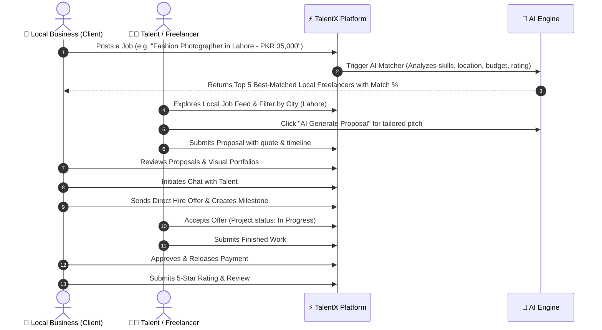

# 🏛️ TalentX — System Architecture & Technical Specification

> **TalentX** is an AI-powered local talent marketplace connecting local businesses and clients with skilled developers, designers, photographers, videographers, marketers, and other local professionals.

---

## 1. High-Level Architecture Diagram

```mermaid
graph TD
    subgraph Client Layer [Frontend - React + Modern UI/UX]
        UI[TalentX Single Page Application]
        Router[View State & Dynamic Tab Routing]
        Theme[Modern Dark/Light Glassmorphism Theme]
        State[Local & Persistent Storage State Manager]
    end

    subgraph Core Functional Modules
        Auth[Auth & Role Controller - Client / Freelancer]
        Profiles[Talent Profiles & Visual Portfolios]
        Jobs[Job Board & Proposal System]
        Hiring[Hiring Lifecycle & Milestone Contracts]
        Chat[Interactive Messaging & Negotiation System]
        Reviews[Rating & Review Engine]
    end

    subgraph Intelligence Layer [AI Engine]
        AIEngine[AI Matching & Recommendation Engine]
        SemanticMatch[Skill & Vector Overlap Scorer]
        LocationWeight[Geo / City Proximity Calculator]
        ProposalHelper[AI Smart Proposal Drafter]
        JobGen[AI Job Description Generator]
    end

    subgraph Data & Storage Layer
        DB[(Local Database / MongoDB Models)]
        SeedData[Curated Pakistani Market Seed Dataset]
        MediaStorage[High-Resolution Portfolio Media Assets]
    end

    UI --> Auth
    UI --> Profiles
    UI --> Jobs
    UI --> Hiring
    UI --> Chat
    UI --> Reviews

    Jobs --> AIEngine
    Profiles --> AIEngine
    AIEngine --> SemanticMatch
    AIEngine --> LocationWeight
    AIEngine --> ProposalHelper
    AIEngine --> JobGen

    Core Functional Modules --> State
    State --> DB
```

---

## 2. Core User Flows



---

## 3. Database Schema & Data Models

### 👤 User & Profile Schema (`User`)
```json
{
  "id": "usr_001",
  "name": "Hamza Tariq",
  "email": "hamza.photo@talentx.pk",
  "role": "talent", 
  "headline": "Commercial & Fashion Photographer | 4K Drone Operator",
  "bio": "Over 5 years capturing high-end fashion shoots, product campaigns, and corporate events across Lahore & Islamabad.",
  "category": "Photography",
  "subcategories": ["Fashion", "Product", "Drone Videography", "Studio Shoot"],
  "skills": ["Canon R5", "Studio Lighting", "Adobe Lightroom", "Photoshop", "Drone Flying", "Color Grading"],
  "hourlyRate": 3500,
  "currency": "PKR",
  "city": "Lahore",
  "area": "Gulberg III",
  "availability": "Available for On-site & Studio",
  "rating": 4.9,
  "reviewCount": 38,
  "completedJobs": 42,
  "badge": "Top Rated Pro",
  "avatar": "https://images.unsplash.com/photo-1534528741775-53994a69daeb",
  "coverImage": "https://images.unsplash.com/photo-1542038784456-1ea8e935640e",
  "portfolio": [
    {
      "id": "port_1",
      "title": "Summer Lawn Brand Campaign 2026",
      "category": "Fashion Photography",
      "image": "https://images.unsplash.com/photo-1515886657613-9f3515b0c78f",
      "description": "50+ editorial looks shot in Lahore studio with custom ambient lighting.",
      "client": "Khaadi Fashion",
      "tags": ["Editorial", "Studio", "Fashion"]
    }
  ]
}
```

### 💼 Job Schema (`Job`)
```json
{
  "id": "job_101",
  "clientId": "usr_client_01",
  "clientName": "Zara Apparel Co.",
  "clientAvatar": "https://images.unsplash.com/photo-1560250097-0b93528c311a",
  "title": "E-Commerce Product & Model Shoot for Eid Collection",
  "category": "Photography",
  "description": "Looking for an experienced photographer in Lahore for a 2-day studio shoot of 40 designer outfits.",
  "budget": 45000,
  "currency": "PKR",
  "budgetType": "Fixed",
  "city": "Lahore",
  "locationType": "On-site",
  "experienceLevel": "Expert",
  "requiredSkills": ["Studio Lighting", "Model Direction", "Adobe Lightroom", "Retouching"],
  "status": "Open",
  "createdAt": "2026-09-20T10:00:00Z",
  "proposalsCount": 4
}
```

### 📝 Proposal Schema (`Proposal`)
```json
{
  "id": "prop_201",
  "jobId": "job_101",
  "talentId": "usr_001",
  "talentName": "Hamza Tariq",
  "bidAmount": 42000,
  "deliveryDays": 3,
  "coverLetter": "Hello! I run a fully equipped studio in Gulberg III with high-end Profoto lighting. Here are 3 similar collections I shot recently...",
  "status": "Pending",
  "submittedAt": "2026-09-21T14:30:00Z"
}
```

### 🤝 Contract / Hiring Schema (`Contract`)
```json
{
  "id": "cnt_301",
  "jobId": "job_101",
  "jobTitle": "E-Commerce Product & Model Shoot",
  "clientId": "usr_client_01",
  "talentId": "usr_001",
  "amount": 42000,
  "status": "In Progress", 
  "milestones": [
    { "title": "Day 1 Studio Shoot", "amount": 20000, "isPaid": true },
    { "title": "Final Color Graded Deliverables", "amount": 22000, "isPaid": false }
  ],
  "startDate": "2026-09-22",
  "deadline": "2026-09-25"
}
```

---

## 4. AI Matching Algorithm (Formula & Logic)

The TalentX AI Engine computes a dynamic **Match Score (0 - 100%)** for each candidate against a job requirement:

$$\text{Match Score} = (W_{skill} \times S_{skill}) + (W_{loc} \times S_{loc}) + (W_{budg} \times S_{budg}) + (W_{rate} \times S_{rate}) + (W_{exp} \times S_{exp})$$

- **Skill Overlap ($S_{skill}$ - 40% weight):** Jaccard similarity between candidate skills/portfolio tags and job requirement tags.
- **Location Proximity ($S_{loc}$ - 25% weight):** Direct city match for on-site gigs = 100%, same province = 60%, remote = 100%.
- **Budget Alignment ($S_{budg}$ - 15% weight):** Hourly rate / expected estimate vs client budget range.
- **Rating & History ($S_{rate}$ - 10% weight):** Verified past reviews score (4.8+ = 100%).
- **Availability & Experience ($S_{exp}$ - 10% weight):** Expert/Intermediate matching requirement.

---

## 5. UI/UX Design System Specification

- **Color Palette:**
  - Deep Slate Charcoal Backgrounds (`#0B0F19`, `#111827`, `#1F2937`)
  - Primary Electric Indigo / Violet Gradient (`#6366F1` ➔ `#8B5CF6`)
  - Emerald Green for Success & Active Status (`#10B981`)
  - Amber Gold for AI Highlights & Ratings (`#F59E0B`)
  - Crisp Glassmorphic Cards with border lighting (`rgba(255, 255, 255, 0.08)`)
- **Typography:** Modern clean sans-serif (Inter / System UI) with crisp hierarchy.
- **Micro-animations:** Smooth tab switching, modal slide-ins, hover elevations, badge pulses, and celebratory confetti upon contract hiring.
